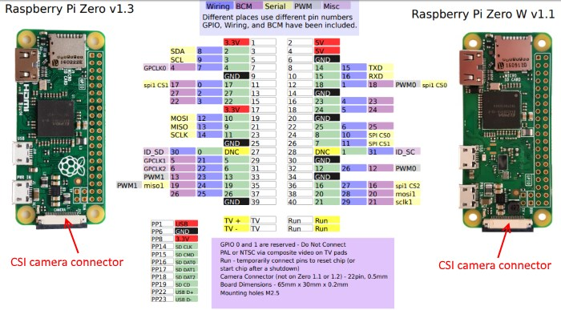
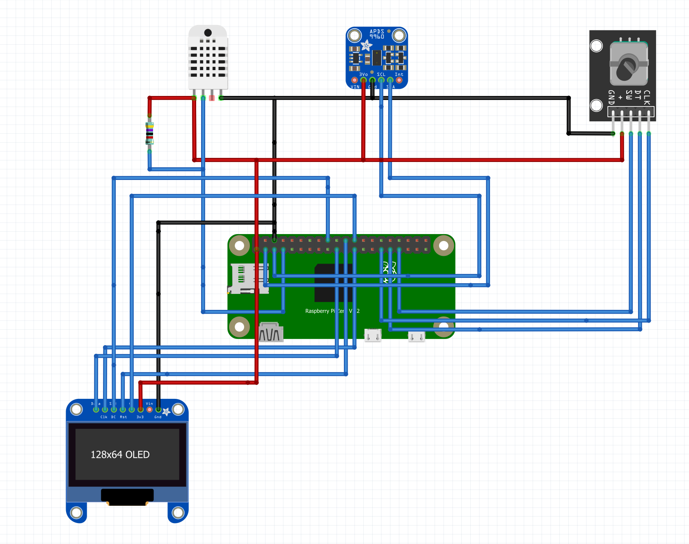
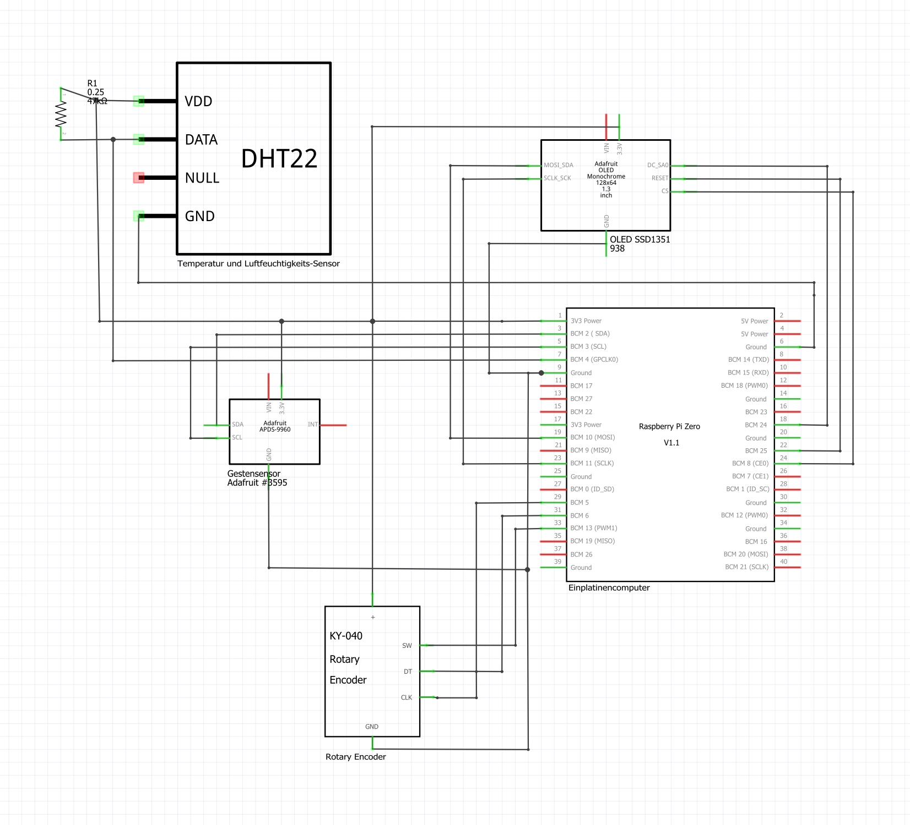

# Create your own BDA!

***
First, this is a university student project, BDA. It stands for Box Displayed Api's.

The purpose of our project is to develop an easy and fast device to facilitate daily tasks for students. 

Additionally, students should have the opportunity to continue to expand our device and its functions independently through their own ideas.

Among other things, this readme is here to make it easier for you to rebuild the device and the implementation that comes with it.
***

# Installation

## Hardware
What component parts are needed?:

- Raspberry PI Zero v.1.3, 1 Ghz, 512 MB Ram [1].

- The Waveshare 1.5 inch RGB OLED display [2].

- The rotary encoder is the AZ Delivery 5 * KY-040 [3].

In addition, sensors can still be attached. In our case we use 

- the gesture sensor Hailege 2pcs APDS-9960 APDS9960 RGB [4] 
- the temperature sensor AZDelivery DHT22 AM2302 [5]

<b> Raspberry Pi's Layout </b>

<b> Wiring diagram (simplified) </b>

<b> Wiring diagram (detailed)  </b>

<b> The color affiliation for the cables are personalized, which means that it doesn't really matter how they are wired. 
It is only our choice of colors  </b>

<b>  Display </b>

| Raspberry Pi  | Color cable | Display  |
| ------------- | ------------- | ------------- |
| 3.3V 1        | red  | Vcc  |
| Ground 6      | black  | Ground  |
| MOSI bcm10  | blue  | MOSI  |
| SCLK bcm11  | yellow  | Clock  |
| SPICS0 bcm8  | orange  | CS (chip select) |
| bcm24  | green | DC (Data command)  |
| bcm25  | white  | reset  |

<b>  Rotary Encoder </b>

| Raspberry Pi  | Color cable | Rotary Encoder  |
| ------------- | ------------- | ------------- |
| GPIO 5        | purple  | CLK  |
| GPIO 6     | white  | DT  |
| GPIO 13  | yellow  | MOSI  |
| 3.3V  | red  | + |
| GND  | black  | GND|

<b> DHT22 </b>

| Raspberry Pi  | Color cable | DHT22  |
| ------------- | ------------- | ------------- |
| GND       | black  | GND  |
| 3.3v    | red  | VDD  |
| GPIO 4  | green  | DATA  |

<b> APDS9960 </b>

| Raspberry Pi  | Color cable | APDS9960  |
| ------------- | ------------- | ------------- |
| GND       | black  | GND  |
| 3.3v    | orange/red  | VCC  |
| SDA BCM2 PIN3  | green  | SDA  |
| SCL BCM3 PIN5  | white  | SCL  |

## Software
 - The Flask framework must be installed. [6]
### References
<b> For the individual installations I will direct you to the GitHub repositories. There you will find out more </b>

#### gesture sensore [8]

#### display  [9]

#### volume changer [10]

- pip install pycaw
- pip install comtypes

#### email  [11]

#### temperature sensor [12]

Website links: 

<b>  The website links I show you here might not be up to date at a later date. </b>

[1]: https://www.reichelt.de/de/de/raspberry-pi-zero-v-1-3-1-ghz-512-mb-ram-rasp-pi-zero-p256439.html?PROVID=2788&gclid=Cj0KCQiAip-PBhDVARIsAPP2xc0vvgy5-AHNTXCVskFo6igphnyoQy1dwCeebWdKbWeSCi1EofPX5XoaAiDVEALw_wcB&&r=1

[2]: https://www.amazon.de/gp/product/B07DB5YFGW/ref=ppx_yo_dt_b_asin_title_o01_s00?ie=UTF8&psc=1

[3]: https://www.amazon.de/AZDelivery-KY-040-Encoder-Compatible-Arduino/dp/B07CMVQHLT/ref=sr_1_2_sspa?dchild=1&keywords=rotary+encoder&qid=1632572749&s=industrial&sr=1-2-spons&psc=1&smid=A1X7QLRQH87QA3&spLa=ZW5jcnlwdGVkUXVhbGlmaWVyPUExOVVOQ0MwMTFRSUROJmVuY3J5cHRlZElkPUEwNjQwNjQzUzRCSVVEV1hNOEFNJmVuY3J5cHRlZEFkSWQ9QTAxNzY2MzQyUjVBSkQ5NUdYRVBXJndpZGdldE5hbWU9c3BfYXRmJmFjdGlvbj1jbGlja1JlZGlyZWN0JmRvTm90TG9nQ2xpY2s9dHJ1ZQ==

[4]: https://www.amazon.de/Gestensensormodul-Handgestenerkennung-Bewegungsrichtung-N%C3%A4herungssensor-Bewegungssensor/dp/B07YJDBFSD/ref=sr_1_2?__mk_de_DE=%C3%85M%C3%85%C5%BD%C3%95%C3%91&crid=2MHHC5QWS706P&keywords=apds9960&qid=1642593810&sprefix=apds+9960%2Caps%2C162&sr=8-2

[5]: https://www.amazon.de/dp/B06XF4TNT9/ref=cm_sw_r_oth_api_glt_i_12DKYP86ENPG24TRVQXB?_encoding=UTF8&psc=1

[6]: https://code.visualstudio.com/docs/python/tutorial-flask

[7]: https://github.com/conradstorz/KY040

[8]: https://github.com/liske/python-apds9960

[9]: https://www.bluetin.io/displays/oled-display-raspberry-pi-ssd1331/

[10]: https://github.com/AndreMiras/pycaw

[11]: https://www.thepythoncode.com/article/reading-emails-in-python

[12]: https://github.com/adafruit/Adafruit_Python_DHT

